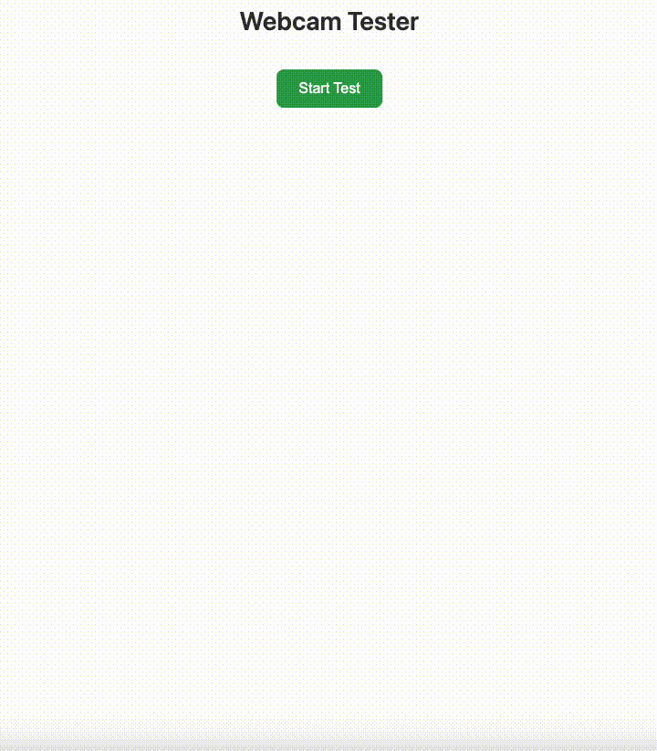

# Webcam Tester Library

[](https://addpipe.com/)
[](https://opensource.org/license/agpl-v3)

`webcam-tester.js` is a JavaScript library for:

1. testing webcam and microphone functionality in web browsers
2. priming browser/OS permissions (and default devices) before users reach your main application (read more about [priming](#how-priming-works))
3. diagnosing webcam & microphone issues

<p align="center">
  </a>
</p>

You can test it [here](https://addpipe.com/webcam-tester/).

## Features

- ✅ **Tests for minimum requirements** - Detects `getUserMedia` (incl. legacy versions), [secure contexts](https://developer.mozilla.org/en-US/docs/Web/Security/Secure_Contexts), [Permissions Policy](https://developer.mozilla.org/en-US/docs/Web/HTTP/Guides/Permissions_Policy)
- 🎥 **Camera Testing** - Complete permission and device functionality checks with device selection
- 🎤 **Microphone Testing** - Independent microphone permission and device testing with device selection
- 📺 **Resolution Testing** - Tests multiple resolutions from 144p to 4K with frame rate detection
- 💡 **Lighting Analysis** - Analyzes camera brightness and provides recommendations
- 🔧 **Other APIs** - Tests [MediaStream Recording API](https://developer.mozilla.org/en-US/docs/Web/API/MediaStream_Recording_API), [MediaStream Image Capture API](https://developer.mozilla.org/en-US/docs/Web/API/MediaStream_Image_Capture_API), [Screen Capture API](https://developer.mozilla.org/en-US/docs/Web/API/Screen_Capture_API) and [Web Audio API](https://developer.mozilla.org/en-US/docs/Web/API/Web_Audio_API)
- 🎨 **Dark Mode** - Built-in light and dark themes
- ⚙️ **Highly Configurable** - Extensive customization options (see config options [below](#configuration-options))
- 📱 **Device Enumeration** - Lists all available audio/video input and output devices (reacts to `ondevicechange`)
- 🔒 **Privacy-First** - No data transmission or storage; Library runs locally in the browser
- 🚀 **Easy Integration** - Insert into any page using a single function call
- 👻 **UI-less Mode** - Run tests programmatically without UI

## Installation & Quick Start

### Via NPM

```bash
npm install @addpipe/webcam-tester
```

```javascript
import { insertWebcamTestLibrary } from "@addpipe/webcam-tester";

// OR

const { insertWebcamTestLibrary } = require("@addpipe/webcam-tester");
```

```html
<!-- This element will be replaced by the library -->
<div id="webcam-tester-container"></div>
```

```javascript
const webcamTester = insertWebcamTestLibrary("webcam-tester-container");
```

### Via CDN

Adding the webcam tests to your web page is as simple as copying and pasting the code below in your page:

```html
<!-- This element will be replaced by the library -->
<div id="webcam-tester-container"></div>

<!-- Minified version (recommended for production) -->
<script src="https://unpkg.com/@addpipe/webcam-tester@latest/dist/webcam-tester.min.js"></script>

<script>
  document.addEventListener("DOMContentLoaded", function () {
    const webcamTester = insertWebcamTestLibrary("webcam-tester-container");
  });
</script>
```

That's it! The library will automatically replace the target element with a complete media testing interface.

You can also include the library’s source code directly in your page instead of loading it from a CDN. To do this, replace the line `<script src="https://unpkg.com/@addpipe/webcam-tester@latest/dist/webcam-tester.min.js"></script>` with the actual [source code](https://github.com/addpipe/webcam-tester/blob/master/src/webcam-tester.js) of the library inside a script tag.

For more advanced code examples, check out the [Examples section](#examples).

## Configuration Options

The library accepts a configuration object with the following options:

```javascript
const webcamTester = insertWebcamTestLibrary("webcam-tester-container", {
  // UI Display Options
  showResults: true, // Show test result logs (default: true)
  showCameraPreview: true, // Show camera preview (default: true)
  showRedoButtons: true, // Show individual redo buttons (default: true)
  showLoadingText: true, // Show loading animations (default: true)
  allowRestart: true, // Allow restarting entire test suite (default: true)
  allowCameraSelection: true, // Allow camera device selection (default: true)
  allowMicSelection: true, // Allow microphone device selection (default: true)

  // Appearance
  darkTheme: false, // Use dark theme (default: false)
  title: "Webcam Tester", // Custom title (default: 'Webcam Tester')

  // Execution Mode
  uiLess: false, // Run without UI (default: false)

  // Test Selection
  tests: [
    // Specific tests to run (default: all)
    "getUserMedia",
    "secureContext",
    "permissionsPolicy",
    "cameraPermissions",
    "micPermissions",
    "devices",
    "capture",
    "resolutions",
    "lighting",
    "otherApis",
  ],

  // Event Callbacks
  callbacks: {
    onTestStart: function () {
      console.log("Testing started");
    },
    onTestComplete: function (result) {
      console.log("Test completed:", result);
    },
    onAllTestsComplete: function (allResults) {
      console.log("All tests finished:", allResults);
    },
    onError: function (testName, error) {
      console.error("Test error:", testName, error);
    },
  },
});
```

## Tests

What does the library test?

### 1. Checks Browser Support for `getUserMedia()`

- Verifies if the browser supports the getUserMedia API
- Checks for legacy implementations
- **Result**: Success if modern API available, warning for legacy, error if unsupported

### 2. Checks for Secure Context

- Ensures the page is running in a secure context (HTTPS, localhost, file:// etc.)
- **Result**: Success if secure, error if not secure

### 3. Checks Permissions Policy
- Verifies that Permissions Policy (formerly Feature Policy) allows camera and microphone access
- **Expandable Info**: Shows detailed policy status for each feature with explanations
- **Result**: Success if all features allowed, warning if some blocked, info if API not supported

**Why this matters:** In supporting browsers, a Permissions Policy can block camera and microphone access before the user is prompted to give their own permission. This is common in cross-origin iframes or when a restrictive `Permissions-Policy` HTTP response header is set.

### 4. Checks Camera Permissions

- Requests camera permissions from the user
- Allows selection of specific camera device (if `allowCameraSelection: true`); on Chrome and Firefox, the selection made in the library UI has higher priority
- Sets up the camera preview if successful
- **Result**: Success if granted, error with specific reason if denied

### 5. Checks Microphone Permissions

- Requests microphone permissions from the user
- Allows selection of specific microphone device (if `allowMicSelection: true`); on Chrome and Firefox, the selection made in the library UI has higher priority
- Works independently from camera permissions
- **Result**: Success if granted, error with specific reason if denied

### 6. Enumerates Devices

- Lists all available audio inputs, video inputs, and audio outputs
- Shows which devices are currently selected
- **Expandable Info**: Shows detailed device lists by category with selection indicators
- **Result**: Success with device count

### 7. Tests Active Streams and Tracks

- Verifies is active media streams or tracks are working correctly
- Displays current capture resolution for video
- Shows status for both audio and video tracks
- **Result**: Success with resolution info, warning if partial capture

### 8. Tests Resolutions

- Tests 8 standard resolutions: 144p, 240p, 360p, 480p, 720p, 1080p, 1440p, 4K
- Measures frame rates for each supported resolution
- **Expandable Info**: Shows all tested resolutions with status and frame rates
- **Result**: Success with supported count and average FPS

### 9. Tests Lighting

- Analyzes camera brightness using pixel data analysis
- Provides recommendations for optimal lighting
- **Expandable Info**: Shows brightness scale (0-255) with explanations
- **Result**: Success/warning based on lighting conditions with brightness value

### 10. Checks Other APIs

- Tests availability of other web APIs:
  - [MediaStream Recording API](https://developer.mozilla.org/en-US/docs/Web/API/MediaStream_Recording_API) (for recording)
  - [MediaStream Image Capture API](https://developer.mozilla.org/en-US/docs/Web/API/MediaStream_Image_Capture_API) (for photo capture)
  - [Screen Capture API](https://developer.mozilla.org/en-US/docs/Web/API/Screen_Capture_API) (for screen sharing)
  - [Web Audio API](https://developer.mozilla.org/en-US/docs/Web/API/Web_Audio_API) (for audio processing)
- **Expandable Info**: Shows detailed status for each capability
- **Result**: Success if capabilities available, warning if limited

## API Methods

Once initialized, the library instance provides these methods:

```javascript
const webcamTester = insertWebcamTestLibrary("webcam-tester-container");

// Start tests programmatically (useful in UI-less mode)
await webcamTester.start();

// Get all test results
const results = webcamTester.getTestResults();
console.log(results);
// Returns: { testId: { id, icon, message, type, details, timestamp, deviceId, deviceLabel }, ... }

// Check if tests are currently running
const isRunning = webcamTester.isRunning();
console.log("Tests running:", isRunning);

// Get the current media stream
const stream = webcamTester.getCurrentStream();
if (stream) {
  // Use the stream for other purposes
  console.log("Stream available:", stream);
}

// Get selected camera information
const cameraInfo = webcamTester.getSelectedCameraInfo();
console.log("Camera:", cameraInfo.deviceLabel, cameraInfo.deviceId);

// Get selected microphone information
const micInfo = webcamTester.getSelectedMicrophoneInfo();
console.log("Microphone:", micInfo.deviceLabel, micInfo.deviceId);

// Clean up resources and remove from DOM
webcamTester.destroy();
```

## Event Callbacks

### onTestStart()

Fired when the user clicks "Start Test" or when `webcamTester.start()` is called programmatically.

```javascript
callbacks: {
    onTestStart: function() {
        console.log('User started testing process');
    }
}
```

### onTestComplete(result)

Fired after each individual test completes. Receives a result object:

```javascript
callbacks: {
    onTestComplete: function(result) {
        console.log(`Test ${result.id} completed:`, result.type);
        // result = {
        //   id, icon, message, type, details,
        //   timestamp, deviceId, deviceLabel
        // }
    }
}
```

### onAllTestsComplete(allResults)

Fired when all tests finish. Receives complete results object:

```javascript
callbacks: {
    onAllTestsComplete: function(allResults) {
        console.log('Testing complete. Results:', allResults);
        // Process final results
        const failedTests = Object.values(allResults)
            .filter(test => test.type === 'error');
        console.log('Failed tests:', failedTests.length);
    }
}
```

### onError(testName, error)

Fired when a test encounters an error:

```javascript
callbacks: {
    onError: function(testName, error) {
        console.error(`Error in ${testName}:`, error);
        // Handle specific test failures
    }
}
```

## Examples

### Basic Usage NPM

```javascript
import { insertWebcamTestLibrary } from "@addpipe/webcam-tester";

// Simple initialization with defaults
const webcamTester = insertWebcamTestLibrary("webcam-tester-container");
```

### Basic Usage CDN

```html
<div id="webcam-tester-container"></div>
```

```javascript
<script src="https://unpkg.com/@addpipe/webcam-tester@latest/dist/webcam-tester.min.js"></script>
<script>
    // Simple initialization with defaults
    const webcamTester = insertWebcamTestLibrary('webcam-tester-container');
</script>
```

### Custom Configuration

```javascript
// Customized for a specific use case
const webcamTester = insertWebcamTestLibrary("webcam-tester-container", {
  darkTheme: true,
  title: "Camera & Mic Check",
  tests: ["cameraPermissions", "micPermissions", "devices", "resolutions"],
  callbacks: {
    onAllTestsComplete: function (results) {
      const cameraOk = results.cameraPermissions?.type === "success";
      const micOk = results.micPermissions?.type === "success";

      if (cameraOk && micOk) {
        // Proceed with main application
        window.location.href = "/start-recording";
      } else {
        // Show help message
        alert("Camera and microphone access is required for recordings");
      }
    },
  },
});
```

### UI-less Mode (Programmatic Usage)

```javascript
// Run tests without any UI
const webcamTester = insertWebcamTestLibrary("webcam-tester-container", {
  uiLess: true,
  allowCameraSelection: false, // Skip device selection UI
  allowMicSelection: false,
  tests: ["getUserMedia", "secureContext", "cameraPermissions", "micPermissions"],
  callbacks: {
    onAllTestsComplete: function (results) {
      console.log("uiLess test results:", results);

      // Process results programmatically
      if (results.cameraPermissions?.result && results.micPermissions?.result) {
        startRecording();
      } else {
        showPermissionError();
      }
    },
  },
});

// Start tests programmatically
await webcamTester.start();

// Get results at any time
const currentResults = webcamTester.getTestResults();
```

### Integration with React

```javascript
import { useEffect, useState } from "react";
import { insertWebcamTestLibrary } from "@addpipe/webcam-tester";

function MediaTester() {
  const [testResults, setTestResults] = useState(null);
  const [testingComplete, setTestingComplete] = useState(false);

  useEffect(() => {
    const webcamTester = insertWebcamTestLibrary("webcam-tester-container", {
      callbacks: {
        onAllTestsComplete: (results) => {
          setTestResults(results);
          setTestingComplete(true);
        },
      },
    });

    return () => webcamTester.destroy(); // Cleanup on unmount
  }, []);

  return (
    <div>
      <div id="webcam-tester-container"></div>
      {testingComplete && (
        <div>
          <h3>Test Results:</h3>
          <pre>{JSON.stringify(testResults, null, 2)}</pre>
        </div>
      )}
    </div>
  );
}
```

### Integration with Vue

```html
<template>
    <div id="webcam-tester-container"></div>
</template>

<script>
import { onMounted, onUnmounted } from 'vue';
import { insertWebcamTestLibrary } from '@addpipe/webcam-tester';

export default {
    name: 'MediaTester',
    setup() {
        let webcamTester = null;

        onMounted(() => {
            webcamTester = insertWebcamTestLibrary('webcam-tester-container', {
                callbacks: {
                    onAllTestsComplete: (results) => {
                        console.log('Tests complete:', results);
                    }
                }
            });
        });

        onUnmounted(() => {
            if (webcamTester) {
                webcamTester.destroy();
            }
        });
    }
};
</script>
```

### Permission Priming with Device Selection

In this example, the library first confirms that camera and microphone permissions have been granted. It then redirects the user to a dedicated video recording page, ensuring that all required permissions are in place before starting the recording. The selected devices ID's are also stored within the local storage in this example.

```javascript
// Use before main video calling interface
const webcamTester = insertWebcamTestLibrary("webcam-tester-container", {
  tests: ["cameraPermissions", "micPermissions"],
  allowCameraSelection: true,
  allowMicSelection: true,
  callbacks: {
    onAllTestsComplete: function (results) {
      const cameraOk = results.cameraPermissions?.type === "success";
      const micOk = results.micPermissions?.type === "success";

      if (cameraOk && micOk) {
        // Get selected devices
        const camera = webcamTester.getSelectedCameraInfo();
        const mic = webcamTester.getSelectedMicrophoneInfo();

        // Store preferences
        localStorage.setItem("preferredCamera", camera.deviceId);
        localStorage.setItem("preferredMic", mic.deviceId);

        // Redirect to main app
        window.location.href = "/record-video";
      }
    },
  },
});
```

### Camera-Only or Mic-Only Testing

In these examples, the library will only test the camera or mic permissions, not both.

```javascript
// Test only camera
const cameraTester = insertWebcamTestLibrary("webcam-tester-container", {
  tests: ["cameraPermissions", "resolutions", "lighting"],
  allowMicSelection: false,
});

// Test only microphone
const micTester = insertWebcamTestLibrary("webcam-tester-container", {
  tests: ["micPermissions", "devices"],
  allowCameraSelection: false,
  showCameraPreview: false,
});
```

## How Priming Works:

1. On Chrome on macOS, it primes user permissions and the default devices (at the domain level; closing all tabs with said domain resets the permission)
2. On Firefox on macOS, it primes user permissions and the default device (at the browser tab x device level; refreshing the tab does not reset permissions)
3. On Safari on macOS, it primes user permission at the tab level (refreshing the tab resets the permission)

Priming works differently when the library is tested through `file://`.

## Device Selection

The library supports device selection for both cameras and microphones. It’s especially handy on Safari which has no device selection UI. On Chrome and Firefox, because they offer their own device selector dialog, we prioritize the device chosen through the library (we use the `exact` keyword when requesting device access).

- **Automatic Detection**: If only one device is available, it's selected automatically
- **Selection UI**: If multiple devices exist, users can choose from a list. On browsers which have their own device selector (Chrome, Firefox, etc.) the device selected through the `webcam-tester.js` UI has higher priority (we use the `exact` keyword)
- **Skip Selection**: Set `allowCameraSelection: false` or `allowMicSelection: false` to skip
- **UI-less Mode**: In UI-less mode, the library automatically uses the media device selected by the user through the browser’s permission prompt. If no device selector is available, it defaults to the one provided by `getUserMedia`

Device selection flow:

1. Camera selection (if enabled and multiple cameras exist)
2. Microphone selection (if enabled and multiple microphones exist)
3. Tests execution

## Privacy & Security

- No data transmission - All processing happens locally
- No data storage - Results are only kept in memory
- Stream cleanup - Automatically stops camera/microphone when removed using the `destroy()` method

## Troubleshooting

### Common Issues

**"getUserMedia not supported"**

- Use HTTPS (not HTTP)
- Update to a modern browser

**"Permission denied"**

- User must click "Allow" in browser prompt
- Check browser settings for camera/microphone permissions
- Ensure no other application is using the devices

**"No devices found"**

- Check physical camera/microphone connections
- Verify devices work in other applications
- Check browser device permissions in settings

**Camera preview shows but tests fail**

- May indicate browser or hardware limitations
- Check console for specific error messages

**Device selection not showing**

- Check that `allowCameraSelection` or `allowMicSelection` is `true`
- Ensure multiple devices are actually available
- Verify browser has permission to enumerate devices

### Debug Mode

Preview detailed logging by opening browser developer tools:

```javascript
const webcamTester = insertWebcamTestLibrary("webcam-tester-container", {
  callbacks: {
    onError: (testName, error) => console.error(testName, error),
    onTestComplete: (result) => console.log(result),
    onAllTestsComplete: (results) => console.table(results),
  },
});
```

## TypeScript Support

TypeScript definitions are included in the package:

```typescript
import { insertWebcamTestLibrary, WebcamDeviceTester, TestResult } from "@addpipe/webcam-tester";

const webcamTester: WebcamDeviceTester = insertWebcamTestLibrary("webcam-tester-container", {
  uiLess: true,
  callbacks: {
    onAllTestsComplete: (results: Record<string, TestResult>) => {
      console.log(results);
    },
  },
});
```

## Contributing

This library is designed to be extensible. To add new webcam & microphone tests:

1. Add test configuration to the `tests` array
2. Implement test method following the pattern `testYourTestName()`
3. Add test to the `testMap` in `runAllTests()`
4. Update documentation

## License

This project is licensed under the GNU Affero General Public License v3.0 (AGPL-3.0).

See [LICENSE](LICENSE) for full details or visit https://www.gnu.org/licenses/agpl-3.0.html

## Changelog

### v1.2.0
- User is now prompted for cam & mic permission only after the (3) minimum requirement tests pass
- Fix: Library no longer throws an alert when a minimum requirement test does not pass

### v1.1.0
- Added [Permissions Policy](https://developer.mozilla.org/en-US/docs/Web/HTTP/Guides/Permissions_Policy) test to check if camera and microphone access is permitted on the page. Permissions Policy is only supported by some browsers
- Fixed a bug where sometimes in React the target element was not found

### v1.0.0

- Initial release
- Core testing functionality
- Configuration options
- API methods and callbacks

---

**Built with ❤️ by the [addpipe.com](https://addpipe.com/) team**