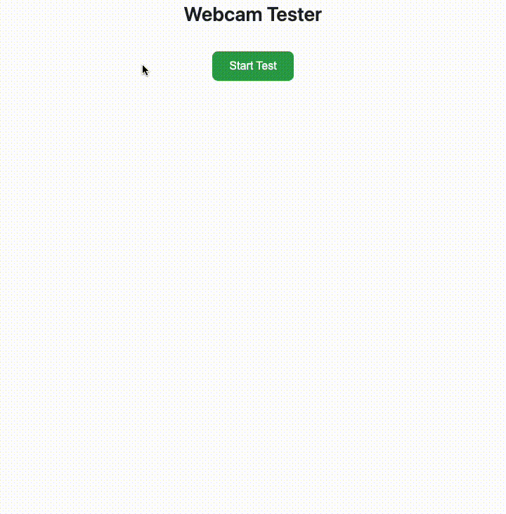

# Webcam Tester Library

[](https://addpipe.com/)
[](https://opensource.org/license/agpl-v3)

`webcam-tester.js` is a comprehensive JavaScript library for:

1. testing webcam and microphone functionality in web browsers
2. priming browser/OS permissions (and default devices) before users reach your main application
3. diagnosing webcam & microphone issues

<p align="center">
  </a>
</p>

## Features

- ✅ **Tests for minimum requirements** - Detects `getUserMedia` (incl. legacy versions) and secure contexts
- 🎥 **Camera Testing** - Complete permission and device functionality checks with device selection
- 🎤 **Microphone Testing** - Independent microphone permission and device testing with device selection
- 📺 **Resolution Testing** - Tests multiple resolutions from 144p to 4K with frame rate detection
- 💡 **Lighting Analysis** - Analyzes camera brightness and provides recommendations
- 🔧 **Other APIs** - Tests MediaStream Recording, MediaStream Image Capture and Screen Capture APIs
- 🎨 **Theme Support** - Built-in light and dark themes
- ⚙️ **Highly Configurable** - Extensive customization options
- 📱 **Device Enumeration** - Lists all available audio/video input and output devices (reacts to `ondevicechange`)
- 🔒 **Privacy-First** - No data transmission or storage, everything runs locally
- 🚀 **Easy Integration** - Single function call to insert into any webpage
- 👻 **Headless Mode** - Run tests programmatically without UI for custom integrations

## Installation

### Via NPM

```bash
npm install @addpipe/webcam-tester
```

### Via CDN

```html
<!-- Minified version (recommended for production) -->
<script src="https://unpkg.com/@addpipe/webcam-tester@1.0.0/dist/webcam-tester.min.js"></script>
```

## Quick Start

### 1. Import the Library

#### Using NPM (ES Modules)

```javascript
import { insertWebcamTestLibrary } from "@addpipe/webcam-tester";
```

#### Using NPM (CommonJS)

```javascript
const { insertWebcamTestLibrary } = require("@addpipe/webcam-tester");
```

#### Using CDN (Plain HTML)

```html
<script src="https://unpkg.com/@addpipe/webcam-tester@1.0.0/dist/webcam-tester.min.js"></script>
```

### 2. Create a Target Element

```html
<!-- This element will be replaced by the library -->
<div id="media-tester-container"></div>
```

### 3. Initialize the Library

```javascript
document.addEventListener("DOMContentLoaded", function () {
  const tester = insertWebcamTestLibrary("media-tester-container");
});
```

That's it! The library will automatically replace the target element with a complete media testing interface.

## Configuration Options

The library accepts a configuration object with the following options:

```javascript
const tester = insertWebcamTestLibrary("my-container", {
  // UI Display Options
  showResults: true, // Show test result logs (default: true)
  showCameraPreview: true, // Show camera preview (default: true)
  showRedoButtons: true, // Show individual redo buttons (default: true)
  showLoadingText: true, // Show loading animations (default: true)
  allowRestart: true, // Allow restarting entire test suite (default: true)
  allowCameraSelection: true, // Allow camera device selection (default: true)
  allowMicSelection: true, // Allow microphone device selection (default: true)

  // Appearance
  darkTheme: false, // Use dark theme (default: false)
  title: "Webcam Tester", // Custom title (default: 'Webcam Tester')

  // Execution Mode
  headless: false, // Run without UI (default: false)

  // Test Selection
  tests: [
    // Specific tests to run (default: all)
    "getUserMedia",
    "secureContext",
    "cameraPermissions",
    "micPermissions",
    "devices",
    "capture",
    "resolutions",
    "lighting",
    "otherApis",
  ],

  // Event Callbacks
  callbacks: {
    onTestStart: function () {
      console.log("Testing started");
    },
    onTestComplete: function (result) {
      console.log("Test completed:", result);
    },
    onAllTestsComplete: function (allResults) {
      console.log("All tests finished:", allResults);
    },
    onError: function (testName, error) {
      console.error("Test error:", testName, error);
    },
  },
});
```

## Test Types

The library performs the following tests in sequence:

### 1. **getUserMedia** - Browser Support Check

- Verifies if the browser supports the getUserMedia API
- Checks for legacy implementations
- **Result**: Success if modern API available, warning for legacy, error if unsupported

### 2. **secureContext** - Security Context Verification

- Ensures the page is running in a secure context (HTTPS/localhost)
- **Result**: Success if secure, error if not secure

### 3. **cameraPermissions** - Camera Permissions

- Requests camera permissions from the user
- Allows selection of specific camera device (if `allowCameraSelection: true`)
- Sets up the camera preview if successful
- **Result**: Success if granted, error with specific reason if denied

### 4. **micPermissions** - Microphone Permissions

- Requests microphone permissions from the user
- Allows selection of specific microphone device (if `allowMicSelection: true`)
- Works independently from camera permissions
- **Result**: Success if granted, error with specific reason if denied

### 5. **devices** - Device Enumeration

- Lists all available audio inputs, video inputs, and audio outputs
- Shows which devices are currently selected
- **Expandable Info**: Shows detailed device lists by category with selection indicators
- **Result**: Success with device count

### 6. **capture** - Media Capture Test

- Verifies active media streams are working correctly
- Displays current capture resolution for video
- Shows status for both audio and video tracks
- **Result**: Success with resolution info, warning if partial capture

### 7. **resolutions** - Resolution Testing

- Tests 8 standard resolutions: 144p, 240p, 360p, 480p, 720p, 1080p, 1440p, 4K
- Measures frame rates for each supported resolution
- **Expandable Info**: Shows all tested resolutions with status and frame rates
- **Result**: Success with supported count and average FPS

### 8. **lighting** - Lighting Analysis

- Analyzes camera brightness using pixel data analysis
- Provides recommendations for optimal lighting
- Works in both UI and headless modes
- **Expandable Info**: Shows brightness scale (0-255) with explanations
- **Result**: Success/warning based on lighting conditions with brightness value

### 9. **otherApis** - Other APIs

- Tests availability of other web APIs:
  - MediaStream Recording API (for recording)
  - MediaStream Image Capture API (for photo capture)
  - Screen Capture API (for screen sharing)
  - Web Audio API (for audio processing)
- **Expandable Info**: Shows detailed status for each capability
- **Result**: Success if capabilities available, warning if limited

## API Methods

Once initialized, the library instance provides these methods:

```javascript
const tester = insertWebcamTestLibrary("my-container");

// Start tests programmatically (useful in headless mode)
await tester.start();

// Get all test results
const results = tester.getTestResults();
console.log(results);
// Returns: { testId: { id, icon, message, type, details, timestamp, deviceId, deviceLabel }, ... }

// Check if tests are currently running
const isRunning = tester.isRunning();
console.log("Tests running:", isRunning);

// Get the current media stream
const stream = tester.getCurrentStream();
if (stream) {
  // Use the stream for other purposes
  console.log("Stream available:", stream);
}

// Get selected camera information
const cameraInfo = tester.getSelectedCameraInfo();
console.log("Camera:", cameraInfo.deviceLabel, cameraInfo.deviceId);

// Get selected microphone information
const micInfo = tester.getSelectedMicrophoneInfo();
console.log("Microphone:", micInfo.deviceLabel, micInfo.deviceId);

// Clean up resources and remove from DOM
tester.destroy();
```

## Event Callbacks

### onTestStart()

Fired when the user clicks "Start Test" or when `tester.start()` is called programmatically.

```javascript
callbacks: {
    onTestStart: function() {
        console.log('User started testing process');
    }
}
```

### onTestComplete(result)

Fired after each individual test completes. Receives a result object:

```javascript
callbacks: {
    onTestComplete: function(result) {
        console.log(`Test ${result.id} completed:`, result.type);
        // result = {
        //   id, icon, message, type, details,
        //   timestamp, deviceId, deviceLabel
        // }
    }
}
```

### onAllTestsComplete(allResults)

Fired when all tests finish. Receives complete results object:

```javascript
callbacks: {
    onAllTestsComplete: function(allResults) {
        console.log('Testing complete. Results:', allResults);
        // Process final results
        const failedTests = Object.values(allResults)
            .filter(test => test.type === 'error');
        console.log('Failed tests:', failedTests.length);
    }
}
```

### onError(testName, error)

Fired when a test encounters an error:

```javascript
callbacks: {
    onError: function(testName, error) {
        console.error(`Error in ${testName}:`, error);
        // Handle specific test failures
    }
}
```

## Examples

### Basic Usage NPM

```javascript
import { insertWebcamTestLibrary } from "@addpipe/webcam-tester";

// Simple initialization with defaults
const tester = insertWebcamTestLibrary("media-test-area");
```

### Basic Usage CDN

```html
<div id="media-test-area"></div>
```

```javascript
<script src="https://unpkg.com/@addpipe/webcam-tester@1.0.0/dist/webcam-tester.min.js"></script>
<script>
    // Simple initialization with defaults
    const tester = insertWebcamTestLibrary('media-test-area');
</script>
```

### Custom Configuration

```javascript
// Customized for a specific use case
const tester = insertWebcamTestLibrary("media-test-area", {
  darkTheme: true,
  title: "Camera & Mic Check",
  tests: ["cameraPermissions", "micPermissions", "devices", "resolutions"],
  callbacks: {
    onAllTestsComplete: function (results) {
      const cameraOk = results.cameraPermissions?.type === "success";
      const micOk = results.micPermissions?.type === "success";

      if (cameraOk && micOk) {
        // Proceed with main application
        window.location.href = "/start-recording";
      } else {
        // Show help message
        alert("Camera and microphone access is required for recordings");
      }
    },
  },
});
```

### Headless Mode (Programmatic Usage)

```javascript
// Run tests without any UI
const tester = insertWebcamTestLibrary("hidden-container", {
  headless: true,
  allowCameraSelection: false, // Skip device selection UI
  allowMicSelection: false,
  tests: ["getUserMedia", "secureContext", "cameraPermissions", "micPermissions"],
  callbacks: {
    onAllTestsComplete: function (results) {
      console.log("Headless test results:", results);

      // Process results programmatically
      if (results.cameraPermissions?.result && results.micPermissions?.result) {
        startRecording();
      } else {
        showPermissionError();
      }
    },
  },
});

// Start tests programmatically
await tester.start();

// Get results at any time
const currentResults = tester.getTestResults();
```

### Integration with React

```javascript
import { useEffect, useState } from "react";
import { insertWebcamTestLibrary } from "@addpipe/webcam-tester";

function MediaTester() {
  const [testResults, setTestResults] = useState(null);
  const [testingComplete, setTestingComplete] = useState(false);

  useEffect(() => {
    const tester = insertWebcamTestLibrary("react-media-tester", {
      callbacks: {
        onAllTestsComplete: (results) => {
          setTestResults(results);
          setTestingComplete(true);
        },
      },
    });

    return () => tester.destroy(); // Cleanup on unmount
  }, []);

  return (
    <div>
      <div id="react-media-tester"></div>
      {testingComplete && (
        <div>
          <h3>Test Results:</h3>
          <pre>{JSON.stringify(testResults, null, 2)}</pre>
        </div>
      )}
    </div>
  );
}
```

### Integration with Vue

```html
<template>
    <div id="media-container"></div>
</template>

<script>
import { onMounted, onUnmounted } from 'vue';
import { insertWebcamTestLibrary } from '@addpipe/webcam-tester';

export default {
    name: 'MediaTester',
    setup() {
        let tester = null;

        onMounted(() => {
            tester = insertWebcamTestLibrary('media-container', {
                callbacks: {
                    onAllTestsComplete: (results) => {
                        console.log('Tests complete:', results);
                    }
                }
            });
        });

        onUnmounted(() => {
            if (tester) {
                tester.destroy();
            }
        });
    }
};
</script>
```

### Permission Priming with Device Selection

```javascript
// Use before main video calling interface
const tester = insertWebcamTestLibrary("permission-primer", {
  tests: ["cameraPermissions", "micPermissions"],
  allowCameraSelection: true,
  allowMicSelection: true,
  callbacks: {
    onAllTestsComplete: function (results) {
      const cameraOk = results.cameraPermissions?.type === "success";
      const micOk = results.micPermissions?.type === "success";

      if (cameraOk && micOk) {
        // Get selected devices
        const camera = tester.getSelectedCameraInfo();
        const mic = tester.getSelectedMicrophoneInfo();

        // Store preferences
        localStorage.setItem("preferredCamera", camera.deviceId);
        localStorage.setItem("preferredMic", mic.deviceId);

        // Redirect to main app
        window.location.href = "/video-conference";
      }
    },
  },
});
```

### Camera-Only or Mic-Only Testing

```javascript
// Test only camera
const cameraTester = insertWebcamTestLibrary("camera-test", {
  tests: ["cameraPermissions", "resolutions", "lighting"],
  allowMicSelection: false,
});

// Test only microphone
const micTester = insertWebcamTestLibrary("mic-test", {
  tests: ["micPermissions", "devices"],
  allowCameraSelection: false,
  showCameraPreview: false,
});
```

## How Priming Works:

1. On Chrome on macOS, it primes user permissions and the default devices (at the domain level; closing all tabs with said domain resets the permission)
2. On Firefox on macOS, it primes user permissions and the default device (at the browser tab x device level; refreshing the tab does not reset permissions)
3. On Safari on macOS, it primes user permission at the tab level (refreshing the tab resets the permission)

## Device Selection

The library supports device selection for both cameras and microphones:

- **Automatic Detection**: If only one device is available, it's selected automatically
- **Selection UI**: If multiple devices exist, users can choose from a list
- **Skip Selection**: Set `allowCameraSelection: false` or `allowMicSelection: false` to skip
- **Headless Mode**: In headless mode, the first available device is used automatically

Device selection flow:

1. Camera selection (if enabled and multiple cameras exist)
2. Microphone selection (if enabled and multiple microphones exist)
3. Tests execution

## Browser Support

- **Modern browsers** with `getUserMedia` API support
- **Secure context** (`https://`, `file://`, localhost, etc.)

## Privacy & Security

- No data transmission - All processing happens locally
- No data storage - Results are only kept in memory
- User consent required - Respects browser permission model
- Secure context enforced - Requires HTTPS for security
- Stream cleanup - Automatically stops camera/microphone when removed

## Troubleshooting

### Common Issues

**"getUserMedia not supported"**

- Use HTTPS (not HTTP)
- Update to a modern browser

**"Permission denied"**

- User must click "Allow" in browser prompt
- Check browser settings for camera/microphone permissions
- Ensure no other application is using the devices

**"No devices found"**

- Check physical camera/microphone connections
- Verify devices work in other applications
- Check browser device permissions in settings

**Camera preview shows but tests fail**

- May indicate browser or hardware limitations
- Check console for specific error messages

**Device selection not showing**

- Check that `allowCameraSelection` or `allowMicSelection` is `true`
- Ensure multiple devices are actually available
- Verify browser has permission to enumerate devices

### Debug Mode

Preview detailed logging by opening browser developer tools:

```javascript
const tester = insertWebcamTestLibrary("my-container", {
  callbacks: {
    onError: (testName, error) => console.error(testName, error),
    onTestComplete: (result) => console.log(result),
    onAllTestsComplete: (results) => console.table(results),
  },
});
```

## TypeScript Support

TypeScript definitions are included in the package:

```typescript
import { insertWebcamTestLibrary, WebcamDeviceTester, TestResult } from "@addpipe/webcam-tester";

const tester: WebcamDeviceTester = insertWebcamTestLibrary("container-id", {
  headless: true,
  callbacks: {
    onAllTestsComplete: (results: Record<string, TestResult>) => {
      console.log(results);
    },
  },
});
```

## Contributing

This library is designed to be extensible. To add new tests:

1. Add test configuration to the `tests` array
2. Implement test method following the pattern `testYourTestName()`
3. Add test to the `testMap` in `runAllTests()`
4. Update documentation

## License

This project is licensed under the GNU Affero General Public License v3.0 (AGPL-3.0).

This means:

- ✅ You can use this library in your projects (commercial and non-commercial)
- ✅ You can modify the library for your own use
- ✅ Attribution to Addpipe must be maintained
- ⚠️ If you modify and distribute the library, you must share those modifications under AGPL-3.0
- ⚠️ **Network use is distribution** - If users interact with your application over a network, you must provide access to the source code
- ❌ You cannot rebrand or resell this library as your own product
- ❌ You cannot use this in proprietary/closed-source applications

**Important:** AGPL-3.0 requires that if you run a modified version of this software on a server and let users interact with it, you must offer them access to the modified source code.

See [LICENSE](LICENSE) for full details or visit https://www.gnu.org/licenses/agpl-3.0.html

## Changelog

### v1.0.0

- Initial release
- Core testing functionality
- Configuration options
- API methods and callbacks
